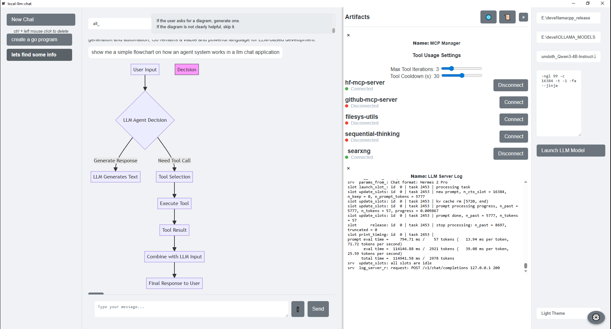

# Local LLM Chat

**Local LLM Chat** is a cross-platform desktop application that provides a user-friendly chat interface for interacting with local large language models (LLMs), specifically designed to work with the `llama.cpp` server. It features agent workflow that allows the LLM to dynamically use external tools to answer questions and complete tasks.

## Features

*   **Chat Interface for Local LLMs:** A simple and intuitive interface for chatting with your local LLMs.
*   **`llama.cpp` Server Support:** Connects directly to a running `llama.cpp` server instance.
*   **Agentic Workflow:** A two-agent system (Router and Tool-Using Agent) intelligently determines when and how to use external tools.
*   **Dynamic Tool Discovery:** The application dynamically discovers and uses tools made available through the Multi-Agent Communication Protocol (MCP).
*   **Cross-Platform:** Built with Wails, it runs on Windows, macOS, and Linux.
*   **Conversation History:** Your conversations are saved locally for future reference.
*   **Save Model Settings:** Per Model argument setting's are saved in the config file and will be there the next time you need to use that model.
*   **AI slop** yes.
*   **bugs** most likely report them better yet fix them!
## Getting Started

### Prerequisites

*   **`llama.cpp` As of v1.0.4 you can download the latest llama.cpp binary release versions within the app itself (orange C++ logo in the artifacts panel), this also will prefill the config with this downloaded version.

### Installation

1.  **Clone the repository:**
    ```bash
    git clone https://github.com/simpala/w-chat.git
    ```
2.  **Navigate to the `local-llm-chat` directory:**
    ```bash
    cd local-llm-chat
    ```
3.  **Build the application:**

    *   **Windows & macOS:**
        ```bash
        wails build
        ```
    *   **Linux:** 
        ```bash
        wails build -tags webkit2_41
        ```
    This will create a binary in the `build/bin` directory.

## Usage

1.  **Run the application:**
    *   On Windows, run `local-llm-chat.exe`.
    *   On macOS, run `local-llm-chat.app`.
    *   On Linux, run `local-llm-chat`.
    *   `llama_cpp_dir`: The directory where your `llama.cpp` server is located.
    *   `models_dir`: The directory where your LLM gguf models are stored.
    *   `selected_model`: The name of the model you want to use.
    *   `model_settings`: Specific settings for the selected model.
    *   `theme`: The theme of the application (e.g., "default", "dark").

## How MCP works within this app

The application uses a two-agent system to handle user queries:

1.  **Router Agent:** This agent first determines if a user's query requires the use of external tools.
2.  **Tool-Using Agent:** If tools are needed, this agent takes over. It discovers available tools, selects the appropriate one, and executes it.

This agent workflow allows the application to be extended with new tools without modifying the core logic. For more details, see the `MCP_README.md` file.

## Known Issues

1. **Think tags**  
   This is a moving target right now. Until Llama.cpp settles on a `reasoning_content` JSON field, I parse the tags after the LLM’s full response and collapse the thinking process. It is subject to change in the near future.

2. **Crashes or hanging application**  
   Sometimes, when switching (very rarely for me), Llama.cpp fails to fully exit and leaves a zombie llama‑server process. If you load a model and send a message that is `NOT` within a chat session, this can lock the application into waiting for the model to respond.

3. **Tool calling**  
   Some models will endlessly call tools if allowed. That’s why I added a maximum iteration limit and a tool cooldown. If the maximum iterations are reached, the process simply exits, allowing you to send messages again. The cooldown prevents overly eager models from repeating the same call in quick succession and overloading context with results. These safeguards mostly work, but mileage may vary



